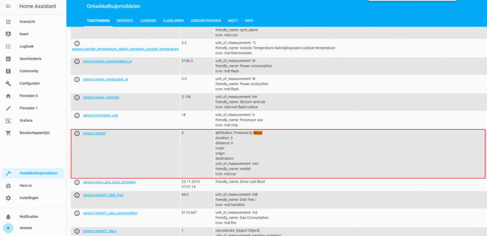

# My Home Assistant collaboration configuration
This is my personal Home Assistant configuration for collaborate with my family.
If you like this repo, be sure ⭐️ Star this repository.




# Required equipment
* [Waze Travel Time](https://www.home-assistant.io/integrations/waze_travel_time/)
* [Zoning](https://www.home-assistant.io/integrations/zone/)
* [GPSLogger](https://www.home-assistant.io/integrations/gpslogger/)
* [Pushbullet notifications](https://www.home-assistant.io/integrations/pushbullet/#notifications)


## About
These are currently my integrations for my [Home Assistant](https://home-assistant.io) collaboration. Do you recognize the problem that you are busy at work, and are often later home than what you were expecting. With this configuration you prevent problems with the lady of the house. Configure a zone for home and your work. Via the GPSLogger, installed on your smartphone, the GPS coordination is passed on to HASS. Therefore HASS knows which zone you are in, and can therefore trigger a push message via an automation, how long the travel time till home is, by a Waze traffic sensor. In this way the home management knows what time the soup can be served.

## Example configuration

###### automations.yaml
```yaml
- id: Bestemming thuis
  alias: Bestemming thuis
  trigger:
  - entity_id: device_tracker.yourdevice
    event: leave
    platform: zone
    zone: zone.werk
  condition:
  - after: '16:40:00'
    before: '18:00:00'
    condition: time
  - condition: state
    entity_id: binary_sensor.workday_sensor
    state: 'on'
  action:
  - data:
      entity_id: input_select.reisbestemming
      option: Thuis
    service: input_select.select_option
  - data:
      message: Ik ben nog {{states.sensor.reistijd.state}} minuten onderweg...
    service: persistent_notification.create
```

###### sensor.yaml
```yaml
- id: Waze travel 01
  platform: waze_travel_time
  name: reistijd
  origin: device_tracker.yourdevice
  destination: zone.home
  region: 'EU'
```

###### input_select.yaml
```yaml
reisbestemming:
  name: Bestemming
  options:
    - Thuis
    - Werk
    - Onbekend
  initial: Onbekend
  icon: mdi:highway
```
